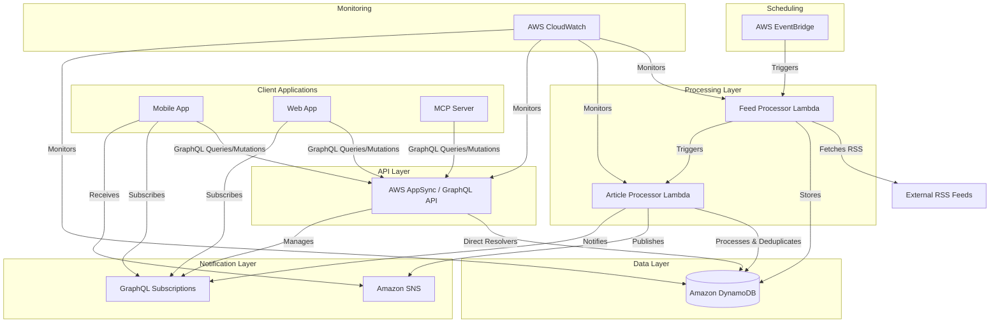

# Design Document: Serverless News Feed Backend

## Overview

This design document outlines the architecture and implementation details for the serverless backend of the RSS news feed application with GraphQL API and real-time notification capabilities. The new system will leverage AWS serverless technologies to provide a scalable, maintainable, and cost-effective solution. This design focuses exclusively on the backend infrastructure and APIs, with separate specs to be created for frontend applications and MCP server integration.

The serverless news feed will consist of several key components:
1. AWS Lambda functions for background processing of RSS feeds
2. AWS AppSync for GraphQL API with direct resolvers and subscription support
3. Amazon DynamoDB for scalable, managed database storage
4. Amazon SNS for push notifications
5. AWS EventBridge for scheduled tasks
6. AWS CloudWatch for monitoring and logging

## Architecture

The architecture follows a serverless, event-driven design pattern that separates concerns into distinct functional components.



## Components and Interfaces

### 1. Data Models

#### Feed Model
```typescript
interface Feed {
  id: string;           // Partition key
  title: string;
  url: string;
  htmlUrl: string;
  category: string;
  feedType: FeedType;    // RSS, Atom, JSON, API, HTML
  parserConfig: object;  // Configuration specific to the feed type
  lastFetched: string;   // ISO timestamp
  fetchFrequency: number; // Minutes between fetches
  isActive: boolean;     // Whether the feed is currently active
}

enum FeedType {
  RSS = 'rss',
  ATOM = 'atom',
  JSON_FEED = 'json_feed',
  CUSTOM_API = 'custom_api',
  HTML = 'html'
}
```

#### Article Model
```typescript
interface Article {
  id: string;           // Partition key (composite of feedId + articleId)
  feedId: string;       // GSI partition key
  title: string;
  content: string;
  abstract: string;     // Summary/description
  link: string;
  pubDate: string;      // ISO timestamp, GSI partition key
  fetchDate: string;    // ISO timestamp
  author: string;
  status: ArticleStatus;
  feedTitle: string;    // Denormalized for query efficiency
  feedCategory: string; // Denormalized for query efficiency
}

enum ArticleStatus {
  NORMAL = 'normal',
  FAVORITE = 'favorite'
}
```

### 2. DynamoDB Table Design

#### Feeds Table
- Partition Key: `id` (UUID)
- No Sort Key
- Attributes: title, url, htmlUrl, category, lastFetched

#### Articles Table
- Partition Key: `id` (UUID or composite key)
- GSI1: 
  - Partition Key: `feedId`
  - Sort Key: `pubDate`
- GSI2:
  - Partition Key: `status`
  - Sort Key: `pubDate`
- GSI3:
  - Partition Key: `pubDate`
  - Sort Key: `feedId`

This design allows for efficient queries by:
- Feed ID to get all articles from a specific feed
- Status to filter articles (normal/favorite)
- Publication date for date range queries
- Combination of the above using filter expressions

### 3. Lambda Functions

#### Feed Processor Lambda
- **Trigger**: EventBridge scheduled event (e.g., every 15 minutes)
- **Purpose**: Fetch content from various feed sources (RSS, Atom, JSON Feed, etc.)
- **Architecture**: Plugin-based system for different feed types
- **Actions**:
  1. Retrieve all feeds from DynamoDB
  2. Determine feed type and select appropriate parser plugin
  3. Fetch content using the selected plugin
  4. Parse the content into a standardized format
  5. Store new articles in DynamoDB
  6. Update the feed's lastFetched timestamp
  7. Trigger the Article Processor Lambda

#### Feed Parser Plugins
- **RSS Parser**: Handles standard RSS feeds
- **Atom Parser**: Handles Atom feeds
- **JSON Feed Parser**: Handles JSON Feed format
- **Custom API Parser**: Handles proprietary APIs with custom authentication and parsing logic
- **HTML Scraper**: For sources without formal feeds (with appropriate rate limiting and respect for robots.txt)

#### Article Processor Lambda
- **Trigger**: Feed Processor Lambda or direct invocation
- **Purpose**: Process new articles, handle deduplication, and trigger notifications
- **Actions**:
  1. Check for duplicate articles based on link or content hash
  2. Filter articles by publication date (only keep recent ones)
  3. Store unique articles in DynamoDB
  4. Publish to SNS topic for notifications
  5. Publish to AppSync for GraphQL subscriptions

#### AppSync Direct Resolvers
- **Purpose**: Handle read and write operations for feeds and articles directly through AppSync
- **Implementation**: Use AppSync direct resolvers with DynamoDB data source
- **Benefits**:
  1. Lower latency by eliminating Lambda cold starts for API operations
  2. Simplified architecture for read/write operations
  3. Direct integration between AppSync and DynamoDB

#### Custom Resolvers (when needed)
- **Purpose**: Handle complex operations that require custom business logic
- **Implementation**: Use AppSync Lambda resolvers only when direct resolvers are insufficient
- **Use Cases**:
  1. Complex filtering or data transformation
  2. Operations requiring multiple data sources
  3. Custom authorization logic

### 4. GraphQL Schema

Building upon the existing schema.graphql file, we'll enhance it with additional features:

```graphql
type Feed {
  id: ID!
  title: String!
  url: String!
  htmlUrl: String
  category: String
  feedType: FeedType
  lastFetched: AWSDateTime
  isActive: Boolean
  articles(limit: Int, status: ArticleStatus): [Article]
}

type Article {
  id: ID!
  feedId: ID!
  title: String!
  content: String
  abstract: String
  link: String!
  pubDate: AWSDateTime!
  fetchDate: AWSDateTime!
  author: String
  status: ArticleStatus!
  feedTitle: String
  feedCategory: String
}

enum ArticleStatus {
  NORMAL
  FAVORITE
}

enum FeedType {
  RSS
  ATOM
  JSON_FEED
  CUSTOM_API
  HTML
}

type Query {
  # Feed queries
  getFeed(id: ID!): Feed
  listFeeds: [Feed]
  
  # Article queries
  getArticle(id: ID!): Article
  getArticlesByFeed(feedId: ID!, limit: Int): [Article]
  getArticlesByStatus(status: ArticleStatus!, limit: Int): [Article]
  getRecentArticles(limit: Int): [Article]
  
  # Enhanced queries
  getArticlesByDateRange(
    fromDate: AWSDateTime, 
    toDate: AWSDateTime, 
    limit: Int,
    feedId: ID,
    status: ArticleStatus
  ): [Article]
  
  getArticlesFromLastDays(
    days: Int!, 
    limit: Int,
    feedId: ID,
    status: ArticleStatus
  ): [Article]
}

type Mutation {
  # Feed mutations
  addFeed(
    title: String!, 
    url: String!, 
    htmlUrl: String, 
    category: String,
    feedType: FeedType,
    parserConfig: AWSJSON
  ): Feed
  
  updateFeed(
    id: ID!,
    title: String, 
    url: String, 
    htmlUrl: String, 
    category: String,
    feedType: FeedType,
    parserConfig: AWSJSON,
    isActive: Boolean
  ): Feed
  
  deleteFeed(id: ID!): UpdateResponse
  
  # Article mutations
  updateArticleStatus(id: ID!, status: ArticleStatus!): Article
  
  # Notification mutations
  subscribeToNotifications(endpoint: String!, protocol: String!): SubscriptionResponse
  unsubscribeFromNotifications(subscriptionArn: String!): UpdateResponse
}

type Subscription {
  onNewArticle(feedId: ID, category: String): Article
  onStatusChange(articleId: ID!): Article
}

type UpdateResponse {
  success: Boolean!
  message: String
}

type SubscriptionResponse {
  success: Boolean!
  subscriptionArn: String
  message: String
}

schema {
  query: Query
  mutation: Mutation
  subscription: Subscription
}
```

Key enhancements to the existing schema include:

1. Added `FeedType` enum and related fields to support multiple feed types
2. Enhanced queries for date range filtering
3. Added subscription types for real-time updates
4. Added notification-related mutations
5. Enhanced feed management with update and delete operations
6. Added response types for operations

### 5. SNS Notification System

The SNS notification system will:
1. Create a topic for new article notifications
2. Allow clients to subscribe with various protocols (email, SMS, mobile push, etc.)
3. Publish messages when new articles are added
4. Include article metadata in the notification payload
5. Handle delivery failures and retries

## Error Handling

### Database Operations
- Use DynamoDB transactions for operations that require atomicity
- Implement exponential backoff for retries on throttled requests
- Use conditional writes to prevent race conditions

### Lambda Functions
- Implement proper error handling and logging
- Use AWS Lambda destinations for asynchronous invocation results
- Configure dead-letter queues for failed executions

### API Errors
- Return standardized error responses with appropriate HTTP status codes
- Include detailed error messages in development, sanitized messages in production
- Log all errors with correlation IDs for traceability

## Testing Strategy

### Unit Testing
- Test individual Lambda functions with mock events
- Test GraphQL resolvers with mock data sources
- Use Jest for JavaScript/TypeScript testing

### Integration Testing
- Test the API endpoints with real requests
- Verify database operations with a test DynamoDB instance
- Test notification delivery with SNS test endpoints

### End-to-End Testing
- Deploy to a staging environment
- Run automated tests against the full system
- Verify subscription and notification workflows

### Performance Testing
- Measure API response times under various loads
- Test concurrent Lambda executions
- Verify DynamoDB throughput capacity

## Deployment Strategy

The system will be deployed using Infrastructure as Code (IaC) with AWS CloudFormation or AWS CDK. The deployment will:

1. Create all required AWS resources (Lambda, DynamoDB, AppSync, etc.)
2. Set up appropriate IAM roles and permissions
3. Configure monitoring and alerting
4. Deploy the application code to Lambda functions
5. Set up the GraphQL schema in AppSync

## Monitoring and Logging

### CloudWatch Metrics
- Lambda execution metrics (invocations, errors, duration)
- DynamoDB metrics (read/write capacity, throttled requests)
- AppSync metrics (latency, error rate)
- Custom metrics for business logic (articles processed, notifications sent)

### CloudWatch Logs
- Structured logging with correlation IDs
- Log levels (DEBUG, INFO, WARN, ERROR)
- Log retention policies
- Log insights queries for common scenarios

### Alarms
- Set up alarms for error rates exceeding thresholds
- Monitor API latency and availability
- Alert on DynamoDB capacity issues
- Track Lambda concurrency and cold starts